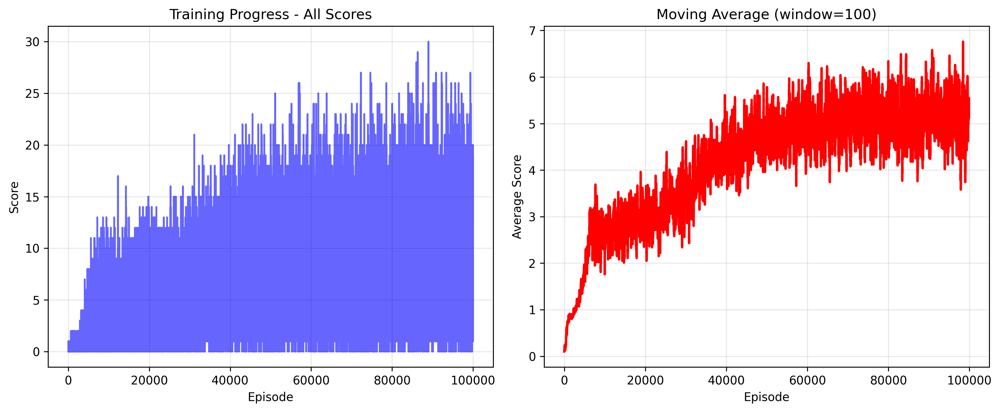

# Snake AI - DQN with Major Upgrades

[简体中文 README](./README.zh.md)

## 🎮 Project Overview (English)

A Snake AI trained with Deep Q-Networks (DQN), upgraded for stability and long-snake performance:
- Double DQN (main net selects actions; target net evaluates) to reduce Q overestimation
- Deeper network (512→256→128→4) with Dropout(0.2)
- Enhanced state: 20×20×4 grid (1600) + 10 extra features (food dx/dy, normalized snake length, 4-direction danger flags, normalized safe-space count)
- Reward shaping for multi-food runs (accelerating bonus) and safety awareness
- One-key graceful stop (Delete/Ctrl+C) that still saves model, logs and graphs

## 🧠 How It Works

### Algorithm
- DQN with Experience Replay and Target Network
- Double DQN action selection/evaluation for stability

### Neural Network (Current)
```
Input (1610) → 512 → 256 → 128 → Output (4 actions)
Dropout(0.2) after first two hidden layers
```

### State Representation (Current)
- 4-layer grid: walls, snake body, snake head, food (shape 4×20×20 = 1600)
- Extra 10 features:
  - Relative food dx, dy (normalized by grid size)
  - Normalized snake length
  - Danger flags for [up, right, down, left] (1 = danger, 0 = safe)
  - Normalized safe-space count in 4 directions

### Reward System (Current)
- Eat food: +15 base; accelerating consecutive bonus with a quadratic term
  - Example: 1st +15; 2nd +19; 3rd +24; 5th +35; 10th +87
- Move relative to food: closer +3; unchanged −0.5; farther −1
- Safety: only penalize dead-ends (−10) and full surround (−5)
- Wall proximity: light penalty only when 1-cell from wall
- Survival penalty: adaptive — decreases as snake grows (longer snake gets more planning time)
- Collisions: −10 for wall or self

#### Training Progress


## ⚙️ Training Configuration (Current)
- Episodes: 100,000
- Batch size: 128
- Learning rate: 0.0003
- Discount factor (Gamma): 0.95
- Epsilon: start 1.0 → min 0.05, slow decay (0.9995)
- Target network update: every 50 episodes
- Checkpoints: every 1,000 episodes

## 📋 Requirements
- Python 3.11 recommended
- See `requirements.txt` (includes `keyboard` for one-key stop)

## 🚀 Installation
```bash
pip install -r requirements.txt
```

## 🎯 Usage

### Train
```bash
python train.py
```
Controls during training:
- Delete: graceful stop (saves `models/snake_model_interrupted.pth`, logs, JSON, and graphs)
- Ctrl+C: graceful stop as well

Outputs:
- Models: checkpoints per 1,000 episodes, final or interrupted model
- Logs: `logs/training_*.log` (CSV-like), `logs/training_*.json`
- Graphs: `graphs/training_progress.png`

### Resume training
```bash
python train.py --mode resume --model models/snake_model_20000.pth --reset-epsilon 0.1
```
Notes:
- `--mode resume` loads an existing model and continues training
- `--reset-epsilon` optionally resets exploration rate (e.g., 0.1)

### Advanced configuration (examples)
```bash
# New training with custom save/log cadence
python train.py --mode new \
  --episodes 100000 \
  --checkpoint-interval 500 \
  --log-interval 50 \
  --save-prefix expA_

# Heavier training setup
python train.py \
  --episodes 150000 \
  --batch-size 256 \
  --lr 0.0002 \
  --gamma 0.97 \
  --epsilon-start 1.0 --epsilon-min 0.05 --epsilon-decay 0.9995 \
  --target-update 50 \
  --replay-size 200000 \
  --device auto \
  --seed 123 \
  --grid-size 20 \
  --max-steps-per-episode 1200
```

### All CLI options (summary)
- Mode / resume
  - `--mode {new|resume}` (default new)
  - `--model PATH` (required for resume)
  - `--reset-epsilon FLOAT` (optional)
- Core training
  - `--episodes INT` (default 100000)
  - `--visualize` (render during training)
  - `--batch-size INT` (default 128)
  - `--lr FLOAT` (default 0.0003)
  - `--gamma FLOAT` (default 0.95)
  - `--epsilon-start FLOAT` (default 1.0)
  - `--epsilon-min FLOAT` (default 0.05)
  - `--epsilon-decay FLOAT` (default 0.9995)
  - `--target-update INT` (default 50)
  - `--replay-size INT` (default 100000)
- Logging / saving
  - `--checkpoint-interval INT` (default 1000)
  - `--log-interval INT` (default 100)
  - `--save-prefix STR` (default snake_model_)
- Env / system
  - `--device {auto|cuda|cpu}` (default auto)
  - `--seed INT`
  - `--grid-size INT` (default 20)
  - `--max-steps-per-episode INT` (default 1000)

### Train options — Beginner Guide

- `--mode {new|resume}` (default: new)
  - What it does: Choose to start fresh or continue from a saved model.
  - When to change: Use resume if you already have a promising checkpoint and want to keep training.
  - Pitfall: Resuming requires the same board size as the model was trained with (same `--grid-size`). If you changed grid-size, start new.
  - Example:
    ```bash
    python train.py --mode resume --model models/snake_model_20000.pth
    ```

- `--model PATH` (resume only)
  - What it does: The checkpoint file to load (a .pth saved by this project).
  - When to change: Required whenever `--mode=resume`.
  - Pitfall: Using a model from a different code/version may cause shape mismatch.

- `--reset-epsilon FLOAT` (resume only)
  - What it does: Reset the exploration rate when resuming (e.g., 0.1).
  - When to change: If training got “stuck” in a local pattern, bump exploration to escape it.
  - Typical values: 0.05–0.2. Higher = more exploration, slower short-term reward, but may learn better strategies.

- `--episodes INT` (default: 100000)
  - What it does: How many games to train in total.
  - Trade-off: More episodes = more stable learning, but longer time.

- `--visualize` (flag)
  - What it does: Show the game window during training.
  - When to use: Debug only. It is 10–100× slower than headless training.
  - Tip: Keep it off for long runs.

- `--batch-size INT` (default: 128)
  - What it does: Number of experiences used per learning step.
  - Trade-off: Larger = smoother updates but needs more GPU memory. With 12GB GPU, 128–256 is a good range.
  - Tip: If you see out-of-memory, lower this first.

- `--lr FLOAT` (default: 0.0003)
  - What it does: Learning rate for the optimizer.
  - Guidance: 2e-4 to 5e-4 is typical for this network. Too high may diverge; too low learns slowly.

- `--gamma FLOAT` (default: 0.95)
  - What it does: How much the agent values future rewards.
  - Guidance: 0.95 is balanced. 0.97–0.99 focuses more on long-term but can slow learning.

- `--epsilon-start FLOAT`, `--epsilon-min FLOAT`, `--epsilon-decay FLOAT` (defaults: 1.0, 0.05, 0.9995)
  - What they do: Control the balance between exploration and exploitation over time.
  - Easy mental model:
    - start = how curious at the very beginning (keep at 1.0).
    - min = curiosity floor later on (0.03–0.1 common).
    - decay = how fast curiosity drops each step (0.995 faster, 0.999–0.9997 slower).
  - If you see “moving back-and-forth in place”, slow the decay and/or raise epsilon-min.

- `--target-update INT` (default: 50)
  - What it does: How often to copy the main network to the target network (in episodes).
  - Guidance: 50–200 is typical. Too frequent reduces stability; too infrequent slows adoption of new behavior.

- `--replay-size INT` (default: 100000)
  - What it does: How many past experiences to keep in the replay buffer.
  - Trade-off: Larger buffers improve stability but use more memory and sampling time. 10k–100k is typical for Snake.
  - Note: Resuming loads weights, not the old buffer.

- `--checkpoint-interval INT` (default: 1000)
  - What it does: Save a model checkpoint every N episodes.
  - Guidance: 500–5000. Smaller = more files, more I/O.

- `--log-interval INT` (default: 100)
  - What it does: How often to print/write logs and update the nested progress bar window.
  - Guidance: Smaller gives more frequent feedback, slightly more overhead.

- `--save-prefix STR` (default: snake_model_)
  - What it does: Prefix for checkpoint filenames under `models/`.
  - Note: Final filenames are fixed: `snake_model_final.pth` or `snake_model_interrupted.pth`. The prefix affects periodic checkpoints only.
  - Example:
    ```bash
    python train.py --save-prefix expA_ --checkpoint-interval 500
    ```

- `--device {auto|cuda|cpu}` (default: auto)
  - What it does: Where to run the neural network.
  - Guidance: auto uses GPU if available; cpu forces CPU (slow); cuda forces GPU (falls back with a warning if unavailable).

- `--seed INT` (default: None)
  - What it does: Set random seeds for fairer comparisons between runs.
  - Note: Exact reproducibility is not guaranteed due to GPU and environment randomness.

- `--grid-size INT` (default: 20)
  - What it does: Board size; affects state dimension dramatically (4×grid² + 10).
  - Pitfall: Changing this makes models incompatible; you cannot resume across different grid sizes.

- `--max-steps-per-episode INT` (default: 1000)
  - What it does: Hard cap to end episodes that loop without progress.
  - Guidance: 500–2000 is a good range. Too small may cut off good plans; too large wastes time.

Common pitfalls & tips
- Resuming with a different `--grid-size` will fail. Start new instead.
- If learning stalls or loops in place: slow `--epsilon-decay` and/or increase `--epsilon-min`; when resuming, try `--reset-epsilon 0.1`.
- For instability (loss spikes): try larger `--batch-size` or larger `--target-update` (less frequent sync).
- For GPU memory issues: reduce `--batch-size` first.

Quick recipes
- Fresh run (safe defaults):
  ```bash
  python train.py --episodes 100000 --batch-size 128 --target-update 50
  ```
- Resume and add exploration:
  ```bash
  python train.py --mode resume --model models/snake_model_20000.pth --reset-epsilon 0.1
  ```
- Faster checkpoints and logs to monitor closely:
  ```bash
  python train.py --checkpoint-interval 500 --log-interval 50 --save-prefix expA_
  ```

### Play options — Beginner Guide

- model (positional; default: `models/snake_model_final.pth`)
  - What it does: Which trained model to visualize.
  - Pitfall: Must match the grid-size used during its training.

- `--fps INT` (default: 10)
  - What it does: Playback speed (frames per second).
  - Guidance: 5–20 for debugging; 30–60 for smoother viewing.

- `--no-grid` (flag)
  - What it does: Hide grid lines for a cleaner view and slight speedup.

During play
- ESC/Q: quit | SPACE: pause/resume | +/-: change FPS | R: restart current game
- Right info panel shows score/best/length/FPS, loop/stuck detection with auto-restart, and death reason.

### Watch the AI play
```bash
python play.py                # use final
python play.py models/snake_model_20000.pth
```
Controls:
- ESC / Q: quit; SPACE: pause; +/-: speed; R: restart
- Info panel shows score/best/length/FPS; loop/stuck detection and auto-restart

## 📊 Expected Results (Indicative)
- Early (≤10k): avg 1–3, max 5–15
- Mid (10–50k): avg 3–7, max 15–40
- Late (50–100k): avg 6–12+, max 40–100+
(Exact values vary with randomness and hardware)

## 📁 Project Structure
```
snake/
├── game.py              # Environment, state, rewards, rendering
├── ai_agent.py          # DQN + Double DQN, network, replay, training
├── train.py             # Training loop, logging, one-key stop, graphing
├── play.py              # Visualize the agent with controls & diagnostics
├── requirements.txt     # Dependencies (incl. keyboard)
├── models/              # Saved models (checkpoints, final, interrupted)
├── logs/                # .log (human) + .json (structured)
└── graphs/              # training_progress.png
```

## 🐛 Troubleshooting
- Shape mismatch (mat1/mat2): ensure state size matches code (now auto-derived from `game.get_state()`)
- Delete key not working: use Ctrl+C to stop
- Slow training: ensure CUDA is used; reduce batch size if needed

## 📚 References
- Mnih et al. 2015 (DQN), Experience Replay, Target Networks
- Double DQN, Dueling DQN, Prioritized Replay (future work)


